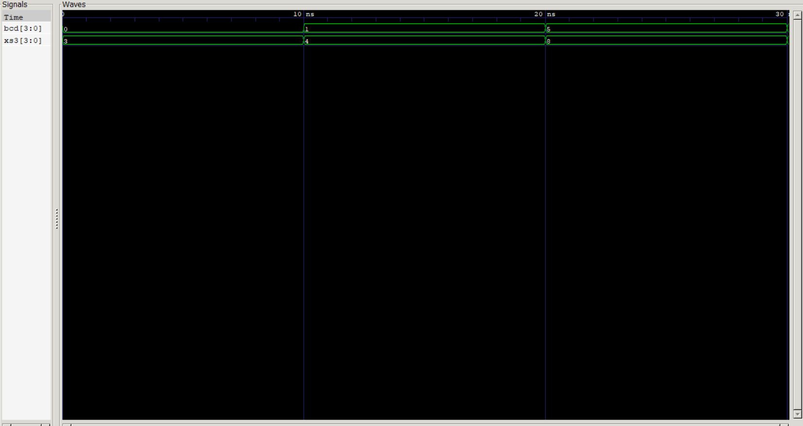
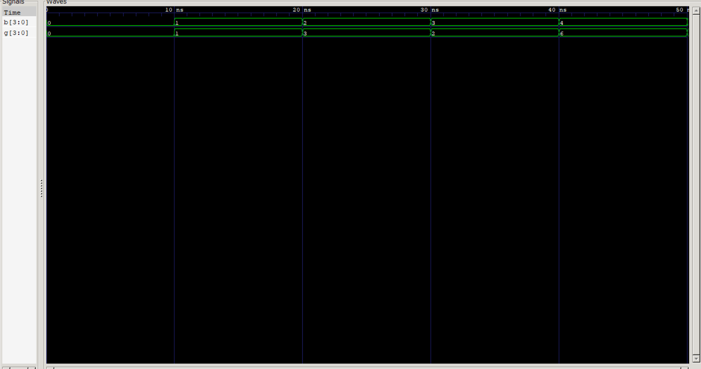

# Lab 6: VHDL Implementation of Code Converters

---

# Aim

The purpose of this experiment is to:

- Develop a VHDL model for a **BCD to Excess-3 (XS-3) Code Converter**.
- Design and simulate a **Binary to Gray Code Converter**.
- Verify the correctness of both converters through simulation.

---

# Background

## 1. BCD to Excess-3 Converter

Excess-3 (XS-3) is a binary-coded decimal representation generated by adding **3 (0011)** to every valid BCD number. Since it is a **self-complementing code**, it simplifies certain arithmetic operations and error detection techniques.

### BCD to Excess-3 Truth Table

| Decimal | BCD Input | Excess-3 Output |
|---------|-----------|-----------------|
| 0 | 0000 | 0011 |
| 1 | 0001 | 0100 |
| 2 | 0010 | 0101 |
| 3 | 0011 | 0110 |
| 4 | 0100 | 0111 |
| 5 | 0101 | 1000 |
| 6 | 0110 | 1001 |
| 7 | 0111 | 1010 |
| 8 | 1000 | 1011 |
| 9 | 1001 | 1100 |

> **Note:** Inputs from `1010` to `1111` are not valid BCD values and are ignored in this implementation.

---

## 2. Binary to Gray Code Converter

Gray code is a binary coding technique in which adjacent values differ by only one bit. This property reduces switching errors and is commonly used in digital communication, shaft encoders, and position sensors.

### Conversion Equations

- Gray MSB = Binary MSB
- Remaining bits are obtained by XORing adjacent binary bits.

```
G3 = B3
G2 = B3 XOR B2
G1 = B2 XOR B1
G0 = B1 XOR B0
```

---

# Simulation Output

### BCD to Excess-3 Converter



### Binary to Gray Converter



---

# Analysis

### BCD to Excess-3

- The converter correctly generates the Excess-3 equivalent for every valid BCD input.
- The output values range from **0011** to **1100**.
- Invalid BCD combinations are excluded from this design but may be handled separately in advanced implementations.

### Binary to Gray

- The Gray code generator follows the standard XOR conversion method.
- Consecutive Gray codes differ by only one bit, reducing the possibility of transition errors.
- Simulation verifies the expected output for all binary inputs.

---

# Result

The VHDL implementations of both code converters were successfully designed and simulated.

- The **BCD to Excess-3 converter** accurately transforms decimal digits encoded in BCD into their XS-3 equivalents.
- The **Binary to Gray converter** correctly produces Gray code using XOR logic.
- Simulation confirms that the outputs match the expected conversion tables, demonstrating the effectiveness of combinational logic design in VHDL.

---

# Conclusion

This experiment provided practical experience in designing combinational circuits using VHDL.

The implementation of the **BCD to Excess-3** and **Binary to Gray** converters demonstrates how digital codes can be translated efficiently for different applications. The successful simulation of both designs validates their functionality and highlights the usefulness of VHDL in digital circuit modeling, testing, and verification.