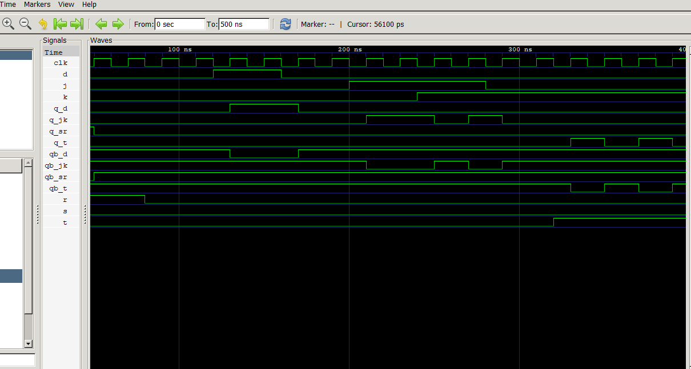

# Lab 7: VHDL Implementation of Sequential Circuits — Flip-Flops

## Objective
- Design and simulate **SR, D, JK, and T flip-flops** using VHDL.
- Understand the operation of rising-edge-triggered sequential circuits and the importance of the clock signal.

---

## Theory

A **flip-flop** is a bistable sequential circuit capable of storing one bit of information. Unlike combinational circuits, its output depends on both the current input values and the previously stored state. In this experiment, all flip-flops are triggered on the **rising edge** of the clock.

### SR Flip-Flop

The **SR (Set-Reset) flip-flop** has two inputs: **S (Set)** and **R (Reset)**. When both inputs are HIGH simultaneously, the output enters an invalid (forbidden) state.

| S | R | Q (Next State) |
|:-:|:-:|:--------------:|
| 0 | 0 | No Change |
| 0 | 1 | Reset (0) |
| 1 | 0 | Set (1) |
| 1 | 1 | Forbidden |

### D Flip-Flop

The **D (Data) flip-flop** transfers the value of input **D** to the output on each rising edge of the clock. It removes the invalid condition found in the SR flip-flop.

**Q(next) = D**

### JK Flip-Flop

The **JK flip-flop** is an improved version of the SR flip-flop. When both **J** and **K** are HIGH, the output toggles instead of entering an invalid state.

**Q(next) = J·Q' + K'·Q**

| J | K | Q (Next State) |
|:-:|:-:|:--------------:|
| 0 | 0 | No Change |
| 0 | 1 | Reset (0) |
| 1 | 0 | Set (1) |
| 1 | 1 | Toggle |

### T Flip-Flop

The **T (Toggle) flip-flop** changes its output whenever **T = 1** and keeps its previous state when **T = 0**.

**Q(next) = T ⊕ Q**

| T | Q (Next State) |
|:-:|:--------------:|
| 0 | No Change |
| 1 | Toggle |

---

## Output

The simulation waveform was viewed using **GTKWave**. The clock signal along with the inputs and outputs of all four flip-flops were added to the waveform window and displayed using the **Zoom Fit** option.

### GTKWave Simulation Output

**Observation:**  
The simulation confirmed the expected behavior of all four flip-flops. The SR flip-flop performed the set and reset operations correctly while avoiding the forbidden condition. The D flip-flop stored the input value at every rising edge of the clock. The JK flip-flop toggled its output whenever both J and K were HIGH. Similarly, the T flip-flop toggled its state when T was HIGH and retained its previous value when T was LOW. Throughout the simulation, the complementary output (**QB**) always remained the inverse of **Q**.

---

## Discussion and Conclusion

In this experiment, **SR, D, JK, and T flip-flops** were implemented using **Behavioral Modeling** in VHDL. Each design used a rising-edge-triggered clock along with an internal signal to generate both **Q** and **QB** outputs. A single testbench with clock generation and sequential input patterns was used to verify the operation of every flip-flop. The GTKWave simulation results confirmed the correct implementation of set, reset, hold, and toggle operations. This experiment strengthened the understanding of sequential logic design and provided the foundation for implementing more advanced digital circuits such as **registers, counters, and finite state machines (FSMs)**.

---

## Output

  

<b>Figure 7.1:</b> GTKWave waveform showing the simulation results of SR, D, JK, and T Flip-Flops.

